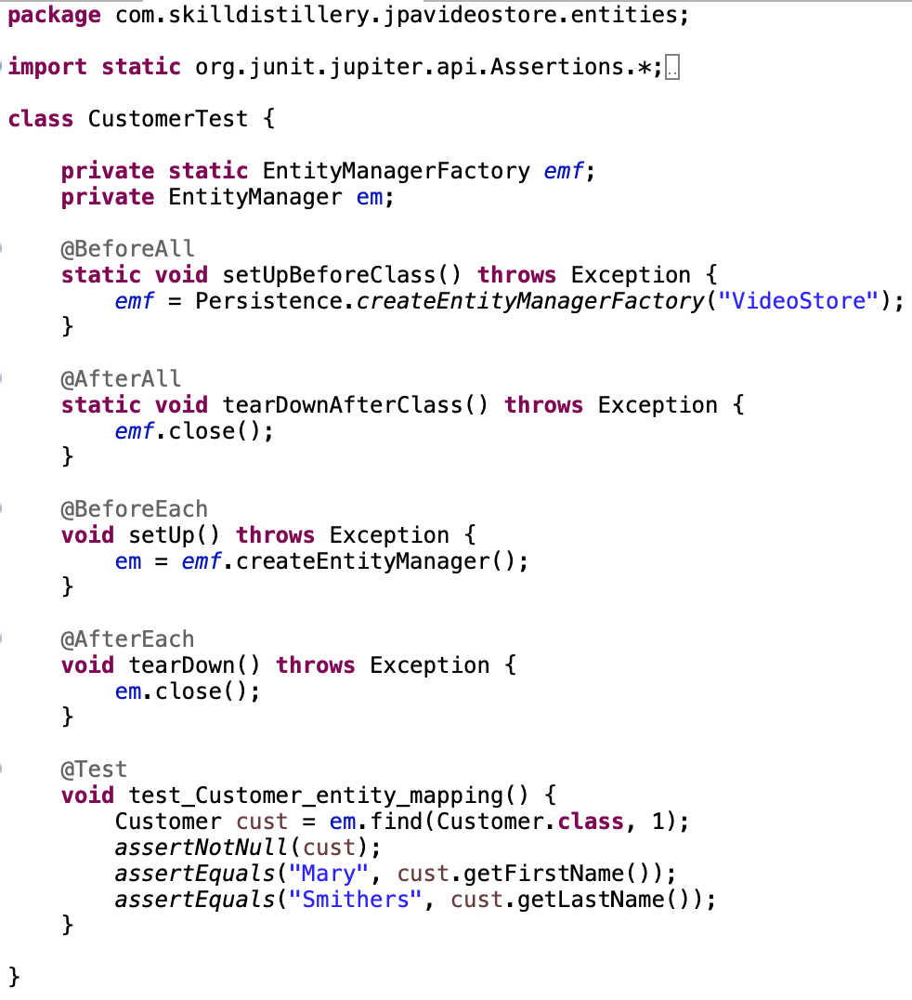

You can use JUnit to create test cases to validate your JPA mappings.

* Create a JUnit ``@BeforeAll`` method that initializes an `EntityManagerFactory` which we will use to create `EntityManager` objects.

* Create JUnit ``@BeforeEach`` and `@AfterEach` methods to initialize and close an `EntityManager` object.

As the names imply, your `@BeforeEach` method is invoked before each test and your `@AfterEach` method runs after each test.

Create individual `@Test` methods to verify your mappings result in values in line with your expectations.

### Drill
> We are going to create a JUnit test for our Customer entity.
>
> 1. In the `entities` package in _src/**test**/java_, create a new JUnit Jupiter test case named `CustomerTest.java`.
>    * Create method stubs for `setUpBeforeClass()`, `tearDownAfterClass`, `setUp()`, and `tearDown()`.
>    
> 1. Include the _JUnit_ assertion library:
>
>    ```java
>     import static org.junit.jupiter.api.Assertions.*;
>    ```
>
> 1. Add two private fields to the newly created class:
>
>    ```java
>    private static EntityManagerFactory emf;
>    private EntityManager em;
>    ```
>
> 1. Use `@BeforeAll` and `@AfterAll` to initialize and close the `EntityManagerFactory`.
>
>    ```java
>    @BeforeAll
>    static void setUpBeforeClass() throws Exception {
>        emf = Persistence.createEntityManagerFactory("VideoStore");
>    }
>    
>    @AfterAll
>    static void tearDownAfterClass() throws Exception {
>        emf.close();
>    }
>    ```
>
> 1. Use `@BeforeEach` and `@AfterEach` to initialize and close the `EntityManager`.
>    
>    ```java
>    @BeforeEach
>    void setUp() throws Exception {
>        em = emf.createEntityManager();
>    }
>    
>    @AfterEach
>    void tearDown() throws Exception {
>        em.close();
>    }
>    ```
> 
> 1. Run the test by right clicking on the test in Eclipse's *Project Explorer* and choosing _Run As -> JUnit Test_.

>    * If everything is configured correctly, the test should run and the `test()` stub should cause an `AssertionFailedError`.
>    * If you get a `PersistenceException` or some other error, check your persistence unit name and other configuration and resolve the issue before continuing.
>
> 1. Write tests.
>    * Change the method `test` to `test_Customer_mappings` and remove the `fail` method. Add code to find the Customer entity with id of 1, and call `assertEquals()` to verify that each field contains expected values. The expected values are in the `customer` table in the database, so you will find these values by querying the database via the command line.
>
>    
>
> 1. Run the test and make any changes necessary until it passes.


### Practice Exercise
>The order in which you close these resources does matter. Closing `emf` before `em` would throw an exception. Can you guess why?

<hr>

[Prev](setupTesting.md) -- [Up](README.md) -- [Next](runningTestsWithGradle.md)

