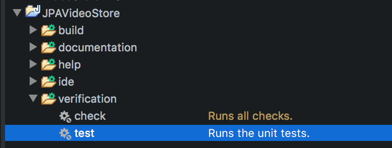

## Running JUnit tests with Gradle

We can leverage our build tool, Gradle, to run our tests as part of the projects build process.

Gradle knows about the _src/test/java_ folder, and will automatically run any tests it finds there.

* Gradle does this automatically any time it builds your project.

* If the tests fail, the build fails.

You can have Gradle run tests without doing a build by running the `verification` | `tests` task.

* Failed tests will show in the console.

* No errors means the tests passed.

### Drill
>
> In the same _src/test/java_ source folder and package, create another _JUnit Test Case_ named `AddressTest`. Configure the file as a JUnit test file and write corresponding tests for the Address entity.
>
> ```bash
> JPAVideoStore
> ├── src/main/java
> │            ├── com.example.jpavideostore.client
> │            │   ├── AddressClient.java
> │            │   ├── CustomerClient.java
> │            │   └── ...
> │            └── com.example.jpavideostore.entities
> │                ├── Address.java
> │                ├── Customer.java
> │                └── ...
> ├── src/main/resources
> │            ├── META-INF
> │            │   └── persistence.xml
> │            └── log4j.properties
> ├── src/test/java
> │            └── com.example.jpavideostore.entities
> │                ├── AddressTest.java
> │                └── CustomerTest.java
> ├── src/test/resources
>              └── log4j.properties
> ```
>
> Use _Run As_ | _JUnit Test_ as usual to run `AddressTest`.
> 
> Now use the Gradle tasks view to run the `test` task in the `verification` group.
>
> 
> 
> Modify `CustomerTest.java` so that one of the tests fails.  Run the `test` task again and observe the results in the console.
>
> Fix the test so it passes again.

<hr>

[Prev](creatingTestFiles.md) -- [Up](README.md) -- [Next](labs.md)

