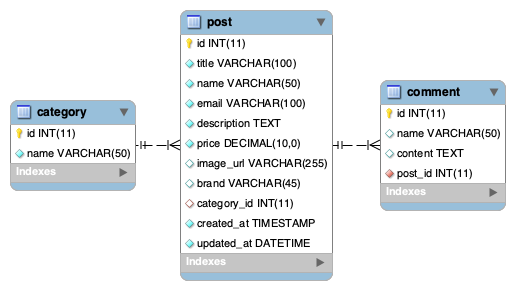

To get some familiarity with Spring REST we are going to be creating a project called `Xtreme9Lives`.

`Xtreme9Lives` is a site where users can post and browse ads for Xtreme experiences and activities. While pushing the boundaries is a lifestyle choice we understand, our application needs to be simple and easy to use for our customers.

The front end team has already mocked an Angular front end for the application using test data. They have provided us with a list of requirements and routes they expect to be able to hit to retrieve the production data.

You have been tasked with building the backend of this application using Spring Boot and Spring REST.

A list of required endpoints (routes) will be provided below, along with their expected functionality.

Test each endpoint using Postman to ensure the data you are returning from your controller is accurate.

### Resources
The front end team has provided you with a `.zip` file that contains the mocked Angular front end. Don't worry about how it works, you will just need to adhere to the contract they specify.

The database administrator has been kind enough to create a SQL schema, database, and some test data. You can download the `.sql` file [here](resources/xtreme.sql) and execute it with `mysql -u root -p < xtreme.sql`.

### Requirements

We need a functional REST API that will aggregate, create, and update data using a SQL database.

Our application is designed around 3 objects:
* Category
* Post
* Comment

You will need to set up the entire schema and Entity relationships. However, for the Alpha product we only need basic CRUD operations on _Post_ objects.

#### Functionality

* Display all Posts at once
  * UI should show the Post `title`, `category`, and `brand`
* Display a single Post that has been selected by a user
  * UI should display the selected Post's `title`, `category`, `brand`, `cost`, `description`, `name`, and `email`
* Allow users to create new Posts for other users to view
  * required fields are `title`, `name`, `email`, `description`, `price`
* Be able to edit or replace a Post that has already been created
* Be able to delete Posts that are deemed inappropriate

Every route we create should be tested via Postman, as well as using web integration testing.

If all goes well, we expect the client will expand the feature set and ask us to add more functionality. (Spoiler: we will.)

### Expected Routes

| Return Type   | Route                 | Functionality                  |
|---------------|-----------------------|--------------------------------|
| `List<Post>`  |`GET api/posts`        | Gets all posts                 |
| `Post`        |`GET api/posts/{id}`   | Gets one post by id            |
| `Post`        |`POST api/posts`       | Creates a new post             |
| `Post`        |`PUT api/posts/{id}`   | Replaces an existing post by id|
| `void`        |`DELETE api/posts/{id}`| Deletes an existing post by id |

### Steps

#### Workspace Setup
1. Create a new STS workspace called `Xtreme9Lives` in `~/SD/Java/`.
   1. Set workspace preferences:
      * **Java** | **Compiler** _Compiler compliance Level_: **`1.8`**
      * **Gradle**: **`Specific Gradle version`** (current latest version)
      * **Run/Debug** | **Console**: UN-check _Limit console output_.
      * **Apply and Close**

#### Database Setup
1. Download the provided [`xtreme.sql`](resources/xtreme.sql) file and and move it to your `Xtreme9Lives` workspace.  Use it to load the database into your local MySQL server: `mysql -u root -p < xtreme.sql`
   * The database name is `xtremedb`.
   * The user for this database is `xtreme` with a password of `xtreme`.
   * Familiarize yourself with the provided schema and data in terminal.

#### JPA Project Setup
1. Inside the `Xtreme9Lives` workspace create a new _JPA Project_ called **XtremeJPA**.
   1. Add new source folders to the build path:
      * `src/main/resources`
      * `src/test/java`
      * `src/test/resources`
   1. Under _JPA implementation_, choose **Disable Library Configuration**
   1. Do NOT open the JPA perspective.
1. Move the `META-INF` folder from `src/main/java` to `src/main/resources`.

##### Configure Gradle for the JPA Project
1. Add Gradle Nature to the project.
1. Open the _Gradle Tasks_ view.
1. Under the `build setup` task group, run the `init` task.
1. Go to the _Console_ view and press _Return_ to answer the required questions until you get `BUILD SUCCESSFUL`.
1. Refresh the _Package Explorer_ view to see the new gradle files.

* Configure the `build.gradle` using a previous JPA project as an example. **Make sure you do not use an MVC or Boot `build.gradle`, as these files differ**.

##### Configure and Test the Persistence Unit
1. From _JPAVideoStore_ copy the `log4j.properties` file into the new project's `src/main/resources/` and `src/test/resources/`.
1. In `persistence.xml`, configure a _Persistence Unit_, making sure to use the appropriate _JDBC_ login information.

1. In a `com.example.xtreme` package, create and annotate a Java entity for the `category` table.

   ```
   +-------+-------------+------+-----+---------+----------------+
   | Field | Type        | Null | Key | Default | Extra          |
   +-------+-------------+------+-----+---------+----------------+
   | id    | int(11)     | NO   | PRI | NULL    | auto_increment |
   | name  | varchar(50) | NO   | UNI | NULL    |                |
   +-------+-------------+------+-----+---------+----------------+
   ```
1. In the same package but under `src/test/java` create an entity unit test.
1. Run the JUnit test to validate the persistence unit configuration.

#### Spring Boot REST Project Setup
1. Create a new _Spring Starter Project_ called **XtremeREST**.
   * Follow the Spring Boot wizard and configure the project.
     * Give the project a base package of **`com.example.xtreme`**
     * Set _Type_ to **Gradle**, _Java Version_ to **8**, and _Packaging_ to **War**.
     * Select the **Spring Web**, **Spring Data JPA**, and **MySQL Driver** dependencies.

1. In the REST project's `settings.gradle` file add:
   ```
   includeFlat 'XtremeJPA'
   ```

1. In the REST project's `build.gradle` add the following to the dependencies:

   ```
   implementation project(':XtremeJPA')
   ```

1. Configure the connection and other properties in `src/main/resources/application.properties`:

   ```
   #### PORT CONFIG ####
   server.port=8082
   
   #### MYSQL DATASOURCE ####
   spring.datasource.url=jdbc:mysql://localhost:3306/xtremedb?useSSL=false&&useLegacyDatetimeCode=false&serverTimezone=US/Mountain
   spring.datasource.username=xtreme
   spring.datasource.password=xtreme
   spring.datasource.driver-class-name=com.mysql.cj.jdbc.Driver
   ```

1. Download the provided [`frontend.zip`](resources/frontend.zip) file of the mocked front end. Unzip the file, `unzip frontend.zip` and move the directory into the `XtremeREST/src/main/resources` folder.

1. Do a refresh of the Package Explorer view, then do a Gradle refresh.

1. Launch `XtremeRestApplication.java` as a Spring Boot App and open it in the browser.

   * You should be able to see the front end application.

#### Complete the JPA entities

1. In the **XtremeJPA** project complete use the provided SQL schema to create Java entities for _Category_, _Post_, _Comment_.

   

   1. Start by just mapping and writing tests for each entity's scalar types, with successful unit tests for each separate entity.

   1. Then add the appropriate bi-directional relationships and test them.

      * A Post has one Category, a Category has many Posts.
      * A Comment has one Post, a Post has many Comments.

1. In your `Post` entity we are going to add two annotations above the fields of type `Date`. `@CreationTimestamp` and `@UpdateTimestamp` instruct JPA to generate values for our `insertedAt` and `updatedAt` fields.

   ```java
   @Column(name="created_at")
   @CreationTimestamp
   private LocalDateTime createdAt;
   
   @Column(name="updated_at")
   @UpdateTimestamp
   private LocalDateTime updatedAt;
   ```

### Implement the REST API for _Post_
1. We are now set up and ready to write our Controller routes and DAO business logic. To ensure we have our environment set up correctly lets write a `ping/pong` route before we start sprinting forward.

   * Create a `PostController` class in a `com.example.xtreme.controllers` package.
   * Annotate the class with `@RestController` and `@RequestMapping("api")`
   * Write a route that returns  the String `"pong"`, mapped to `ping`.
   * Launch the project and hit the route `localhost:8080/api/ping` using Postman.

1. In a `com.example.xtreme.data` package, create a `PostDAO` Interface and `PostDaoImpl` implementing class.
   * Annotate the Impl with `@Transactional` and `@Service`.
   * Use `@PersistenceContext` to bring in a field of type _EntityManager_.
   * Back in your `PostController` autowire in a field of type `PostDAO`.

1. Start implementing the business logic for the required routes. Follow the recommendations below.
   * Write the DAO logic for a CRUD operation before you write the corresponding Controller route.
   * Don't assume your routes work, test each one using Postman and maybe even try to break them.
   * Ensure that the response status code accurately represents what occurred in success and failure.
   * Once a route is working and tested, open the application in a browser and test to see if the functionality has been integrated with the front end. You may need to restart the application before each attempt.

**NOTE** when implementing create functionality a Post has a NOT NULL relationship with a category. For now, hard code every created post to category 5. We will develop this functionality and allow a user to select a category in a later release.

### Expected Routes

| Return Type   | Route                 | Functionality                  |
|---------------|-----------------------|--------------------------------|
| `List<Post>`  |`GET api/posts`        | Gets all posts                 |
| `Post`        |`GET api/posts/{id}`   | Gets one post by id            |
| `Post`        |`POST api/posts`       | Creates a new post             |
| `Post`        |`PUT api/posts/{id}`   | Replaces an existing post by id|
| `void`        |`DELETE api/posts/{id}`| Deletes an existing post by id |

<hr>

[Up](../README.md)
