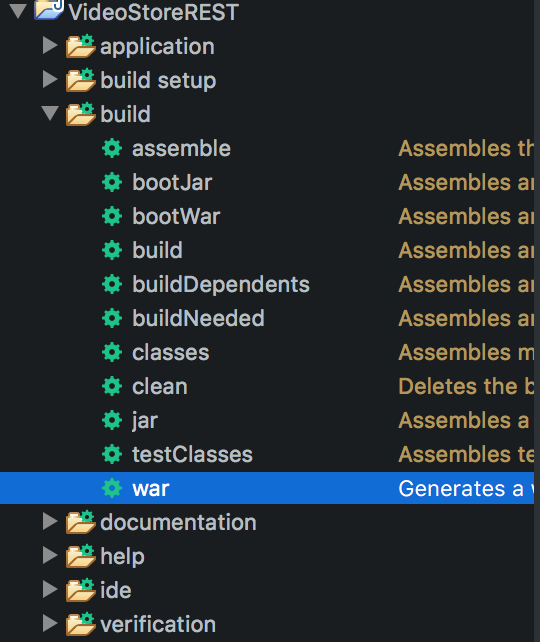

## Deploying Spring Boot Apps

### A WAR-Packaged Spring Boot App

#### Application Entry Point

When we deploy to the existing Tomcat web container, Tomcat won't call our Boot application's `main` method.

* Instead, it needs another way of configuring and launching our application.

If we chose `War` _Packaging_ when we created our app, our dependencies will be set up for building a WAR file with our build tool (Maven or Gradle).

* The _Spring Boot_ starter will create a `ServletInitializer` class that allows Tomcat to launch our application.

#### JMX Identifier

When multiple Spring Boot applications are deployed to a Tomcat server, each needs a unique internal identifier for Tomcat's management functions.

In `application.properties`, add:

```
spring.jmx.default-domain=EventTracker
```

(You can choose any unique value for this property.)


1. Open `application.properties` and add:
   ```
   # You can substitute your application name for "EventTracker"
   spring.jmx.default-domain=EventTracker
   ```

### WAR File Creation

We can customize how Gradle builds the WAR file.

1. Open your `build.gradle` file.

1. Add the following war task to specify where the war file should be created and what it should be called.
   ```
   war {
     // Gradle will replace the variable archivesBaseName
     // with our app name, as defined in settings.gradle
     archiveFileName = "${archivesBaseName}.war"
     destinationDirectory = file("../")     // Project workspace directory
   }
   ```
1. _Gradle_ | _Refresh Gradle project_

### Deploying

#### Application Database
Your application's database must be deployed and accessible on the server before you deploy your application WAR file.

1. Use MySQL Workbench _Forward Engineer_ to dump your schema to a `.sql` file to your project's workspace directory.

1. Secure copy your dump file to your AWS instance (in your local terminal):
    * ***NOTE***: 123.45.6.78 is a placeholder for your IP address

    ```bash
    scp -i ~/.ssh/aws.pem ~/SD/Java/YOURWORKSPACENAME/dump.sql ec2-user@12.34.56.78:~
    ```

1. Secure Shell into your server and import your dump.sql into your sql server:

   * Connect to your AWS server from your terminal:

     ```bash
     ssh -i ~/.ssh/aws.pem ec2-user@12.34.56.78
     ```

    * On your remote server, load your dump.sql into MySQL:

      ```bash
      mysql -u root -p < ~/dump.sql
      ```

#### Application Deployment

1. In the gradle tasks area select the project you are trying to deploy and run the `build/war` task.
    

1. Secure copy your `.war` file to your AWS instance (in your local terminal). Use your IP address, not the one in the example. Navigate into your projects directory in terminal and then execute:

    ```bash
    scp -i ~/.ssh/aws.pem YOURPROJECTNAME.war ec2-user@12.34.56.78:/var/lib/tomcat/webapps/
    ```

<hr>

[Prev](README.md) | [Up](README.md)

