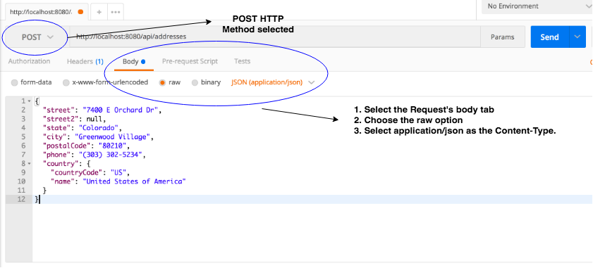

## Demo: Address Create Route

We can now retrieve all addresses and a single address by its id. Now lets try to create a new address and persist it to our database via a resource route.

1. Create a method in your _DAO_ that takes an `Address` object and persists it to the database.  The method should return the saved address.

1. In your controller write a POST method called `create` mapped to the route `/api/addresses`. You are going to need to extract the json we send inside of the request from the request body, converting it to an Address object.  Pass it to the DAO method above, and returned the address to the client.

1. Run the program and hit the route `http://localhost:8080/api/addresses` with a POST request via Postman. To add content to the body of a Postman request, go to the Body tab, click on raw, and type any valid json into this text area. For our purposes we need to provide a json representation of an address object:
```json
{
    "street": "7400 E Orchard Dr",
    "street2": null,
    "state": "Colorado",
    "city": "Greenwood Village",
    "postalCode": "80210",
    "phone": "(303) 302-5234",
    "country": {
      "countryCode": "US",
      "name": "United States of America"
    }
}
```



<hr>

[Prev](addressShowRoute.md) | [Up](README.md) | [Next](filmListRoute.md)

