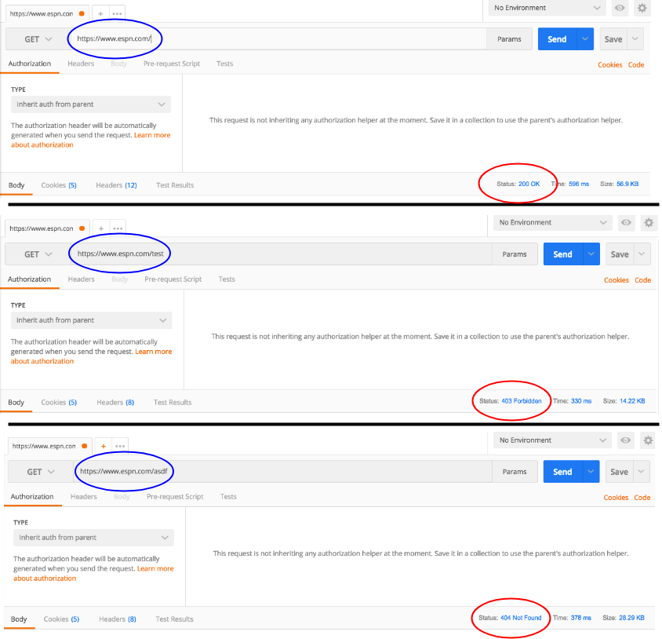

## HTTP Status codes

Status codes give us information on the status of our request. There are five classes of HTTP response codes indicated by the first digit of the code.

**1XX**->  Informational: I'm going to send you some information

**2XX's**->  Success: Your request was successful  

**3XX's**->  Location changed/redirect: I'm going to send you somewhere else  

**4XX's**-> Client error: You messed up

**5XX's**-> Server error: I messed up

As you spend more and more time programming you will start to become familiar with status codes you see regularly. Some important/standard response codes are as follows:
  * 200: OK - the request was successful.
    * Response body is sent.
  * 201: Created - request was successful and a new resource was created.
    * Response must include `Location` header with URL for the newly-created resource.
    * Response body includes description of the status of the request, and a reference to the newly-created resource.
      * For our purposes, sending a representation of the created resources will do.
  * 202: Accepted - the request was received but not acted upon.
  * 204: No Content - the request was successful.
    * No response body is sent.
  * 401: Unauthorized - need authentication to access the resource.
  * 404: Not found - cannot find resource.
  * 415: Unsupported media type - format of the request data is not supported.
  * 500: Internal server error - server has encountered an error.

For a full list of status codes look at the following resources.
* [HTTP Status Dogs](https://httpstatusdogs.com/)
* [HTTP status code cheat sheet](https://www.cheatography.com/kstep/cheat-sheets/http-status-codes/)
* [Full list of status codes](http://www.restapitutorial.com/httpstatuscodes.html)

[Prev](README.md) | [Up](README.md) | [Next](httpServlet.md)

