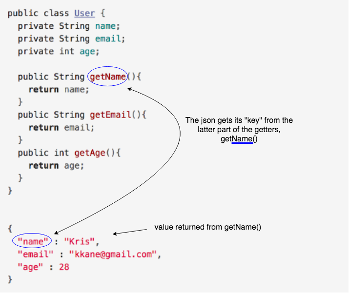

## POJO To JSON

By default, when you use the `@ResponseBody` and `@Controller` annotations, or `@RestController`, Spring will look for the Jackson-Databind Library.

If Spring finds the library it will convert the POJO returned by the controller method to its JSON representation.

### Practice Exercise
JSON is not the only format you can return. Some REST API's deal with XML or a number of other formats. You can find a full list of returnable `MediaType`s [here](http://docs.oracle.com/javaee/7/api/javax/ws/rs/core/MediaType.html).

If we define a `User` class in Java like so:
```java
public class User {
  private String name;
  private String email;
  private int age;

  // ...
}
```

The JSON representation of an instance of this class would look like this:
```java
User kris = new User("Kris", "kkane@gmail.com", 28);
```
```json
{
  "name":"Kris",
  "email":"kkane@gmail.com",
  "age":28
}
```

#### How Does Jackson Do This?

Jackson accomplishes this conversion by using the public _getters_ on the Java class to return values.

* It then removes the 'get' and uses the method name as the key for the returned value.



### JSON To POJO

Assume that we had a form on a web page that would take in the necessary information to construct a new `User` object, in this case a *name*, *email*, and *age*. 

We can use a class called `ObjectMapper` to **map** the JSON fields to the Java object property.

We would use syntax like this to use the `ObjectMapper` class defined in the Jackson library:

```java
ObjectMapper mapper = new ObjectMapper();
User user = mapper.readValue(UserJSONString, User.class);
```

Similar to the JSON to POJO conversion, the Jackson Library uses the JSON key values to determine what public _setter_ method to call.

It then sets the corresponding value into the Java object.

#### Where would we get the JSON String from?

In order to have access to the JSON, we need to access the request body sent by the client's POST, PUT, or PATCH.

We can use Spring's `@RequestBody` annotation to access this.

This annotation injects the JSON content sent in the request body into a defined variable.

The following is an example of a POST request where we access the body.

```java
@RequestMapping(path="users", method=RequestMethod.POST)
public void create(@RequestBody String userJson){
  ObjectMapper mapper = new ObjectMapper();
  try{
    User newUser = mapper.readValue(userJson, User.class);
    quizDAO.addUser(newUser);
  }
  catch(Exception e){
    e.printStackTrace();
  }
}
```

_However, we don't need to do this ourselves._

Spring will automatically convert the JSON request body to the POJO type of the parameter.

* This is similar to how Spring creates a command object from form input fields.

* If the JSON can't be converted to the parameter object type an exception will occur.

  ```java
  @RequestMapping(path="users", method=RequestMethod.POST)
  public void create(@RequestBody User user){
    quizDAO.addUser(user);
  }
  ```

<hr>

[Prev](json.md) -- [Up](README.md) -- [Next](recursiveJson.md)

