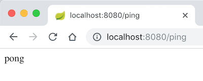
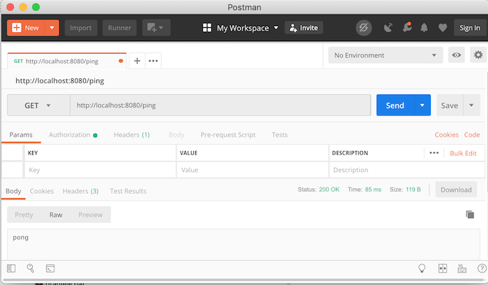

## Testing Endpoints with Postman

We can test `GET` endpoints directly in the browser.



* We can also `POST` with an HTML form, but other HTTP methods require JavaScript to execute.

Another tool for interacting with a server is `curl`, a command-line client for requesting URLs.

```bash
curl -X GET http://localhost:8080/ping
pong
```

* `curl` can execute any HTTP request method, reading request body content from a file or the command line, allows setting of request headers and many other options, and works with a wide variety of protocols.

### Postman

_Postman_ is a graphical development environment for testing web APIs.



With Postman you can:
* Execute any HTTP request.
* Send request bodies in a variety of formats.
* Set request headers.
* Provide authentication credentials for secured APIs.
* Create and reuse collections of tests for different APIs.

### Drill

1. Launch your program and hit `http://localhost:8080/ping` with your browser.

1. Download and install the Postman app from https://www.getpostman.com/.

1. Hit `http://localhost:8080/ping` with the Postman tool. You should receive a string response of `pong`.


<hr>

[Prev](dependencies.md) | [Up](README.md) | [Next](restController.md)

