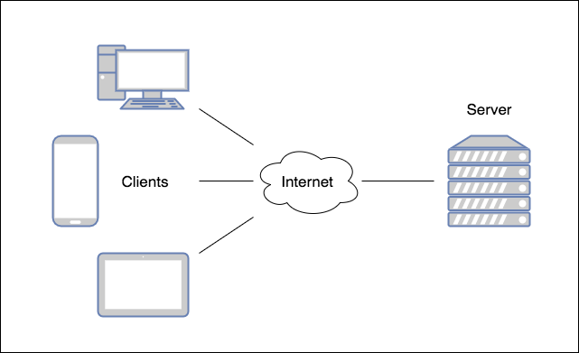
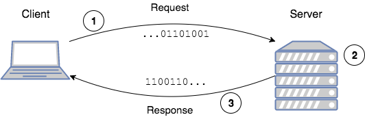
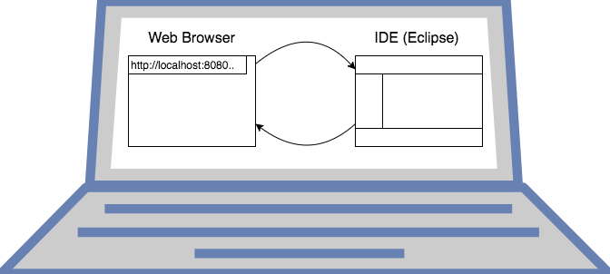

Much of the Internet uses a **client-server** model.

**Clients** are devices that request data from a resource or service.

**Servers** are the locations of those resources or services.

Web browsers (Chrome, Firefox) and web applications (SnapChat) are examples of clients.

### Data Transfer

Data transfer starts with the client.
* The client initiates communication with a server by making a **request** for the server's content or service function.
* The server then **handles** the request and returns a **response**, such as a Web page.

This transfer of data is called the _request-response cycle_.

1. Client initiates a request.
2. Server processes (handles) the request.
3. Server returns a response.

A server does not have to be something out on the Internet.
* The diagram below shows a Web browser client making a request to a program running on Eclipse, both on the same laptop.

This is the same request-response cycle, just on a single computer.
1. Browser (client) makes a request.
2. Program (server) running on IDE handles it.
3. Program returns a response to browser.

> ### Skill++
> The client-server model is different than a _Peer-to-Peer_ (P2P) model where all devices are considered peers, and thus communicate with each other directly to share resources and services.

[Prev](internet-basics.md) -- [Up](README.md) -- [Next](uri.md)

