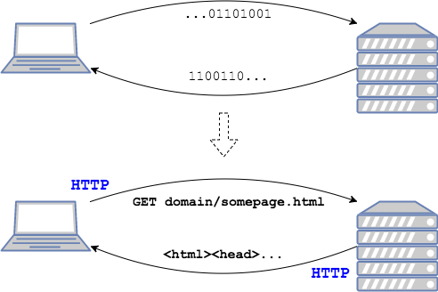
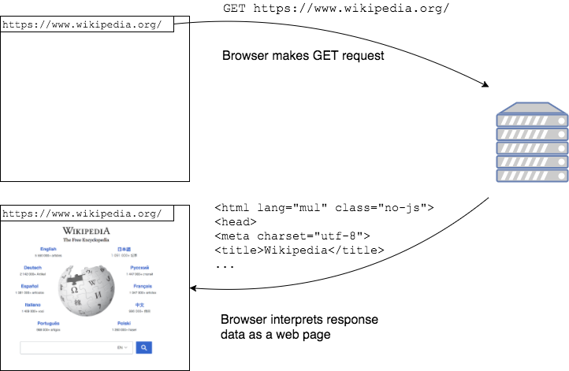

Since data is `0`'s and `1`'s, both sides of a transfer use protocols to translate that data to messages.

**HTTP** is the language clients, such as Web browsers, and Web servers use to transfer Web pages.

### HTTP Requests

A browser makes a request for a resource and specifies that it is using `HTTP`.
* The browser also specifies the type of request to tell the server what it's trying to do.
* The two basic request types are `GET` and `POST`.

#### `GET` Request

A `GET` request is intended to retrieve a document.
* `GET` should only retrieve data.
* `GET` requests remain in the browser's history.
* Visiting a web page is usually a `GET` request.

#### `POST` Request

A `POST` request submits data to a server to be processed.
* `POST` is intended for providing information to a server that might be used by the server to modify content on the site.
* Submitting a form on a site should be a `POST` request.

### Server Response
The server, also using `HTTP`, responds to the request with the data.
* The browser knows how to read the data, and can display it as a web page.

[Prev](uri.md) -- [Up](README.md) -- [Next](labs.md)

