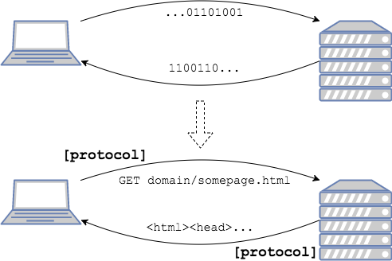

The Internet is a global network of billions of computers or other electronic devices.
* The pieces of this network are connected by physical cables, such as copper telephone wires, TV lines, and fiber optic cables, which span the entire globe - below or above ground, and [across the ocean floor](https://www.submarinecablemap.com/).
* Even wireless connections, such as Wi-Fi, ultimately rely on these cables.

At its simplest, the Internet exists to carry data, `0`'s and `1`'s, from one place to another.

### Protocols

Protocols are **rules or standards** for how the members of a network present and read data - in other words, speak the same language.

Protocols can exist at several levels in a connection. For example:
* Certain protocols allow hardware to transfer data between devices.
* Other protocols define the exchange of data between programs running on those devices.

By following protocols, the devices on each side of the connection know how to interpret the `0`'s and `1`'s of data.

[Prev](README.md) | [Up](README.md) | [Next](clients-and-servers.md)

