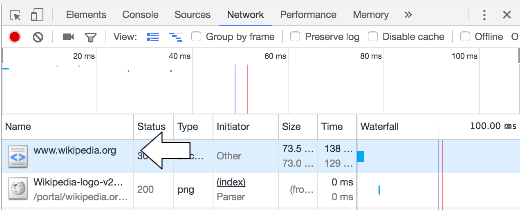

We can use the _Chrome Developer Tools_ to see requests.

1. Open a Google Chrome browser.
1. Open Developer Tools using either
   * _View->Developer->Developer Tools_
   * &#8984;&#8997; I (Command Option India)
1. You can choose where the Tools display by clicking the options icon.

   

1. Select the _Network_ tab.
1. In the browser's address bar, type `https://www.wikipedia.org/`.
1. Click the first option, `www.wikipedia.org`.

   
1. The _Headers_ tab shows the `GET` request your browser made to request the Web page.

   

1. The _Response_ tab shows the data returned, which is `HTML` text.

   

> ### Skill++
> _Chrome Developer Tools_ is full of excellent widgets to help you build Web applications.

[Prev](http-protocol.md) -- [Up](README.md)

